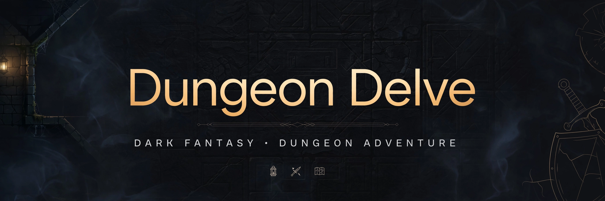

# 3js_Games — Dungeon Delve

> ## Status: 🟢 Completed
>
> <progress value="90" max="100"></progress>
>
> **Progress: 90%** — A complete, playable Three.js dungeon crawler; only polish and deployment remain.

<p align="center">
  
</p>

 

## What it is

**Dungeon Delve** is a tiny, self-contained 3D dungeon crawler that runs in the browser. The dungeon is procedurally assembled from a hand-written ASCII map using the Kenney modular dungeon kit (GLB models), the player picks from 18 Kenney characters, then explores a room-and-corridor dungeon to reach the finish flag. All 3D assets are local to the repo; only Three.js itself loads from a CDN. The entire game is two files: `index.html` (UI) + `main.js` (1,400 lines of game logic).

## What works (verified)

Verified by reading all of `main.js` and `index.html`, and by syntax-checking with `node --check` (2026-10-08):

- ✅ Loading screen → character select (18 playable characters, `characters./Models/GLB format/character-a..r.glb`)
- ✅ Dungeon assembled from an ASCII `LAYOUT` grid: start room, large/wide rooms, corridors (auto-picks straight/corner/end/junction/intersection with correct rotation), locked gate, stairs, floor switch, finish room
- ✅ A* pathfinding with click-to-move (doorway-aware room connectivity), plus camera-relative keyboard movement
- ✅ Locked gate that opens via a floor switch (`P`) in another room
- ✅ HUD: timer, step counter, fog-of-war minimap, hint arrow, toast messages
- ✅ Win condition: reach the flag → win screen with time/steps
- ✅ Debug API (`window.DUNGEON`): scene stats, path checks, layout dump — the last commit was a dungeon-bug fix round ("single room placement, doorway-aware connectivity, A* click navigation"), so this code has been play-tested and fixed
- ✅ All referenced GLB models exist in the repo (verified `kenney_modular-dungeon-kit_1.0/Models/GLB format/` and `characters./Models/GLB format/` contents)

## Tech stack

| Layer | Technology |
|---|---|
| 3D | Three.js 0.160.0 via CDN importmap (`three`, `three/addons/`) |
| Models | Kenney modular dungeon kit + Kenney characters pack (GLB, local files) |
| Language | Vanilla JavaScript (ES modules), no build step |
| UI | Plain HTML/CSS overlays (title, select, HUD, win screens) |

## How to run

It's static files — any static server works (the repo's own header comment recommends `npx serve`):

```sh
cd 3js_Games
npx serve .
# then open the shown URL — internet access is needed for the Three.js CDN
```

Or: `python3 -m http.server 8000` and open `http://localhost:8000`. No install, no build.

## Screenshots

None in the repo. The banner above is a stand-in; run the game to see it — the dungeon, characters and HUD are all real 3D.

## What you can add more

- [ ] **More levels** — the ASCII `LAYOUT` system makes new dungeons easy; add a level select
- [ ] **Enemies / combat** — the dungeon has no threats yet; add simple patrol enemies or traps
- [ ] **Collectibles** — keys, gold, potions along the route
- [ ] **Sound** — WebAudio footsteps, gate rumble, win fanfare
- [ ] **Bundle Three.js locally** — currently CDN-only; vendor it for offline play
- [ ] **Deploy** — push to GitHub Pages; it's static and would work as-is

## Project structure

```
3js_Games/
├── index.html                        # Title/loading/select/HUD/win overlays + importmap
├── main.js                           # Full game: dungeon gen, A* nav, player, HUD, debug API
├── kenney_modular-dungeon-kit_1.0/   # Dungeon room/corridor GLB models (Kenney, CC0)
├── characters./                      # 18 character GLB models (Kenney, CC0)
│   └── Models/GLB format/            # (note: the folder name has a trailing dot)
└── Icon                              # (empty placeholder file)
```

---
*README written after code audit on 2026-10-08.*
